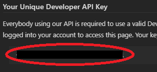
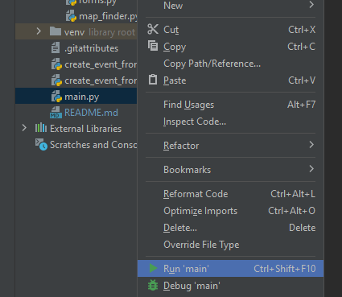

# Trackmania Event Creator

## How to Use

### Event Creator
This is still in development for general use. If you have some programming experience you may be able to figure it out, but it's better you wait until there's more info here.

### TMWT Scrim Creator
To start creating scrims, follow these steps. Most of this is first-time setup which can be skipped for subsequent scrims.

1. Install [PyCharm](https://www.jetbrains.com/pycharm/) or your favorite Python IDE (or use terminal)
2. Copy `tmwt_scrim/scrim_configs/template.yaml` into a new `.yaml` file in the same directory
2. Fill it in, following the template comments as a guide and the existing Damascus vs 100% Canadians config
2. Create a Pastebin account and go to [https://pastebin.com/doc_api](https://pastebin.com/doc_api) to see your unique developer API Key
   3. 
4. Go to [base64decode.org](base64decode.org) and click "Encode", and type your ubisoft account info: "email:password"
5. If using PyCharm, right click on `main.py` and try running it
   6. 
7. The following should pop up. Set up a python runtime (tested on 3.9), and click on the document symbol under "Environment Variables"
   8. 
9. Add a new environment variable "AUTHORIZATION" and set it to "Basic <your-base64-credentials>"
10. Add another environment variable "PASTEBIN_DEV_KEY" and set it to your dev key found on [https://pastebin.com/doc_api](https://pastebin.com/doc_api)
11. Finally, go to `main.py` and change the input to variable "config" to be the name of the config you made in `scrim_configs`
12. Check to see your scrim is on [https://admin.trackmania.nadeo.club/competitions?page=0](https://admin.trackmania.nadeo.club/competitions?page=0)

## Contact
This is currently primarily being developed and managed by Nixotica.

Join the discord for development and progress https://discord.gg/r3b67352ne